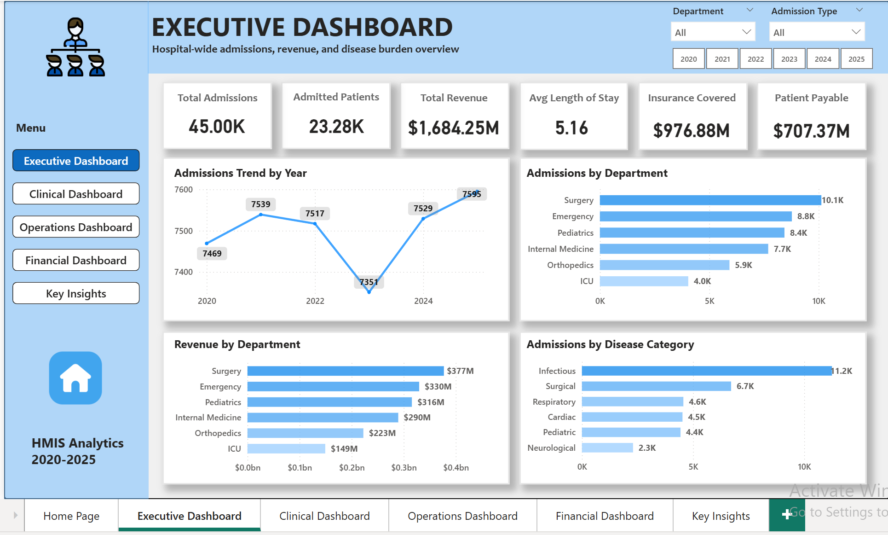
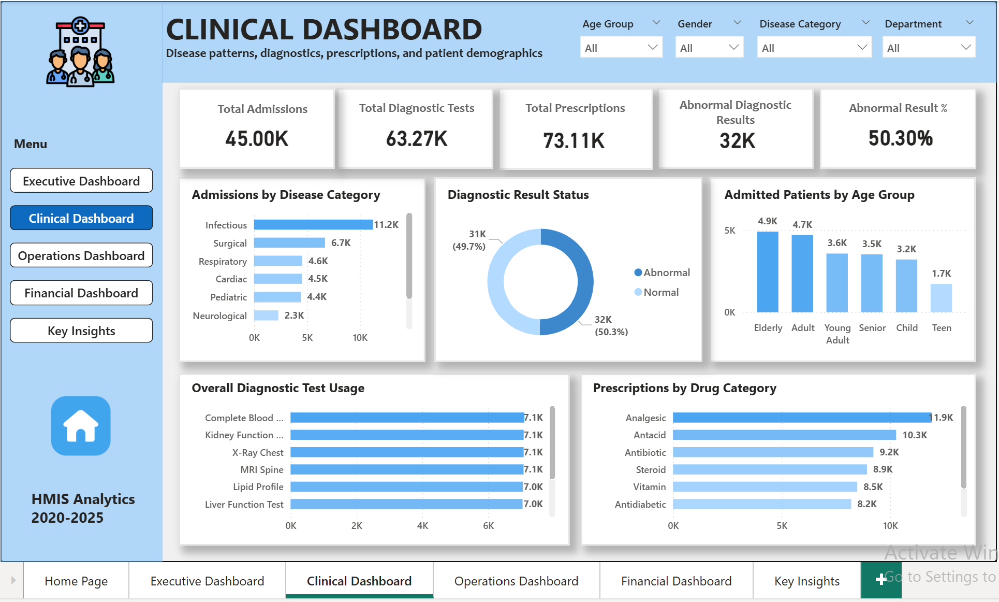
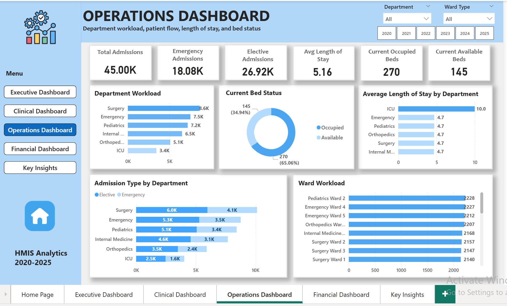
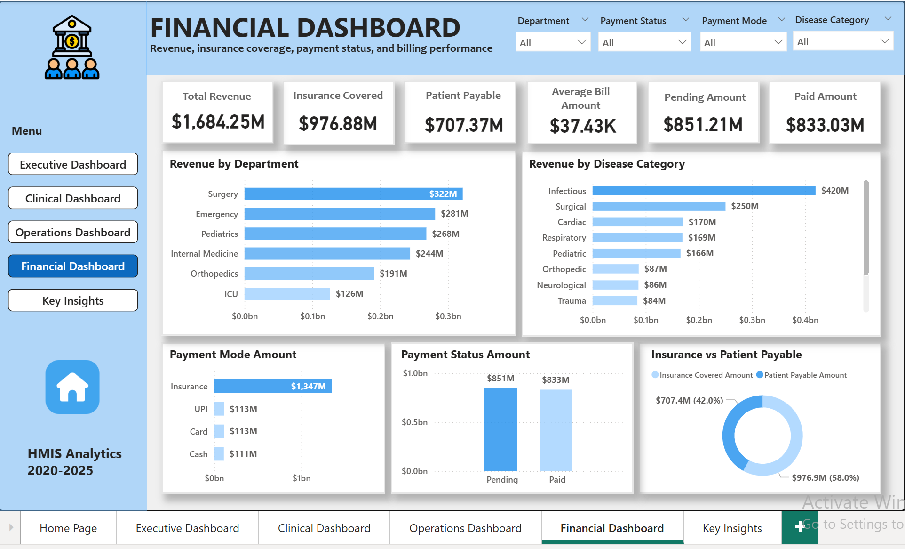

# AI-Assisted Hospital Operations & Patient Analytics Dashboard

A healthcare analytics portfolio project focused on hospital operations, clinical patterns, billing performance, and stakeholder-ready dashboard reporting.

The project demonstrates an end-to-end analytics workflow from data understanding and cleaning to SQL validation, Power BI dashboarding, and insight communication.

## Project Objective

The objective of this project is to analyze synthetic Hospital Management Information System (HMIS) data and convert it into practical healthcare business insights using Python, SQL, and Power BI.

The project answers questions such as:

- How many patients were admitted over time?
- Which departments handle the highest workload?
- Which disease categories contribute most to admissions?
- How do emergency and elective admissions compare?
- Which departments and disease categories generate the most revenue?
- What is the split between insurance-covered and patient-payable billing?
- How can validated metrics be converted into clear stakeholder insight summaries?

## Tools Used

- Python
- pandas
- numpy
- matplotlib
- MySQL
- SQL
- Power BI
- GitHub
- AI-assisted insight drafting

## Dataset

The project uses a synthetic Hospital Management Information System (HMIS) dataset designed for healthcare analytics and dashboard development.

The dataset contains normalized relational CSV tables covering:

- Patient demographics
- Admissions and discharges
- Departments, wards, and beds
- Diseases and diagnosis categories
- Diagnostic tests
- Prescriptions and drugs
- Billing and insurance
- Staff and doctor information

Data period: 2020-2025  
Admission records: 45,000  
Patient records: 30,000

Important note: This dataset is fully synthetic and does not contain real patient information. It is used only for education, portfolio demonstration, and analytics practice.

## Project Workflow

1. Business understanding and KPI planning
2. Dataset selection and structure understanding
3. Data quality review and data dictionary creation
4. Data cleaning and preprocessing using Python
5. SQL-based KPI analysis and validation
6. Python exploratory data analysis
7. Power BI dashboard development
8. AI-assisted insight summary drafting
9. GitHub documentation and portfolio preparation

## Dashboard Pages

The Power BI report contains the following pages:

1. Home Page
2. Executive Dashboard
3. Clinical Dashboard
4. Operations Dashboard
5. Financial Dashboard
6. Key Insights

Power BI report file:

```text
dashboard/Hospital_Operations_Patient_Analytics.pbix
```

## Dashboard Preview

### Home Page


### Executive Dashboard



### Clinical Dashboard



### Operations Dashboard



### Financial Dashboard



### Key Insights


## Key Metrics

- Total admissions: 45K
- Admitted patients: 23.28K
- Total revenue: $1,684M
- Insurance covered amount: $976.88M
- Patient payable amount: $707.37M
- Average length of stay: 5.16 days
- Diagnostic tests: 63K
- Prescriptions: 73K
- Abnormal diagnostic result rate: 50.3%

## Dashboard Insights

### Executive Insights

- The hospital recorded 45K admissions across 2020-2025.
- Surgery had the highest admission volume and revenue contribution.
- Infectious diseases formed the largest disease burden.
- Average length of stay was 5.16 days, showing moderate inpatient utilization.

### Clinical Insights

- The dataset includes 63K diagnostic tests and 73K prescriptions.
- Abnormal diagnostic results were around 50.3% of all test results.
- Infectious, surgical, respiratory, cardiac, and pediatric conditions were the major clinical categories.
- Elderly and adult patients represented the highest admitted patient groups.

### Operations Insights

- Elective admissions were higher than emergency admissions.
- ICU had the highest average length of stay compared with other departments.
- Surgery, Emergency, and Pediatrics handled the highest admission workload.
- Current bed status should be interpreted separately from historical admission trends.

### Financial Insights

- Total revenue was approximately $1,684M.
- Insurance covered about 58% of total billed revenue.
- Patient payable amount contributed around 42%.
- Surgery generated the highest department-level revenue.

## AI-Assisted Insight Summary Approach

The AI-assisted part of this project is focused on insight communication, not automated clinical decision-making.

Python, SQL, and Power BI were used to clean, analyze, validate, and visualize the data. After the metrics were validated, AI assistance was used to draft concise stakeholder-friendly insight summaries. The summaries were manually reviewed and refined to ensure they matched the dashboard outputs.

This reflects a realistic analyst workflow where AI supports communication and documentation after the data analysis has been completed and validated.

## Data Quality and Validation Notes

- Primary key checks were performed across core tables.
- Duplicate checks were performed during dataset understanding.
- Missing values and inconsistent fields were reviewed before analysis.
- SQL outputs were used to validate Power BI KPI cards and dashboard totals.
- Billing table values were treated as the financial source of truth.
- Bed status was interpreted as current hospital bed status, not historical occupancy over time.

## Project Limitations

- The dataset is synthetic and does not represent a real hospital.
- Pediatric department and pediatric disease category are not restricted only to child patients because of synthetic data design.
- Bed status is current-state information and should not be interpreted as historical bed occupancy trend.
- Billing table values were used as the financial source of truth because billing detail line items do not fully reconcile with bill-level totals.
- Admission dates were used for admission trend analysis instead of bill dates, because bill dates are less appropriate for patient flow trends.
- AI was used only for drafting insight summaries, not for diagnosis, prediction, or clinical decision-making.

## Repository Structure

```text
Healthcare-Analytics-Project/
├── ai-insights/
├── dashboard/
│   └── Hospital_Operations_Patient_Analytics.pbix
├── data/
│   ├── raw/
│   └── processed/
├── docs/
│   ├── project-planning.md
│   ├── dataset-understanding.md
│   ├── data-dictionary.md
│   ├── data-quality-report.md
│   ├── cleaning-strategy.md
│   ├── stage3-validation-report.md
│   ├── stage4-sql-summary.md
│   ├── stage5-python-eda-results.md
│   ├── stage6-powerbi-dax-measures.md
│   └── stage6-powerbi-dashboard-summary.md
├── notebooks/
│   ├── 01_dataset_understanding.ipynb
│   ├── 02_data_cleaning_preprocessing.ipynb
│   └── 03_python_eda.ipynb
├── screenshots/
│   ├── Home page.png
│   ├── Executive.png
│   ├── Clinical.png
│   ├── Operations.png
│   ├── Financial.png
│   └── Key Insights.png
├── scripts/
│   └── load_processed_to_mysql.py
├── sql/
│   ├── 01_database_validation.sql
│   ├── 02_core_kpis.sql
│   ├── 03_executive_dashboard_queries.sql
│   ├── 04_clinical_dashboard_queries.sql
│   ├── 05_operations_dashboard_queries.sql
│   └── 06_financial_dashboard_queries.sql
├── visuals/
└── README.md
```

## Main Project Files

- Dataset understanding notebook: `notebooks/01_dataset_understanding.ipynb`
- Data cleaning notebook: `notebooks/02_data_cleaning_preprocessing.ipynb`
- Python EDA notebook: `notebooks/03_python_eda.ipynb`
- SQL validation and KPI queries: `sql/`
- Power BI dashboard: `dashboard/Hospital_Operations_Patient_Analytics.pbix`
- Dashboard screenshots: `screenshots/`
- EDA visuals: `visuals/`
- Documentation and validation notes: `docs/`

## Portfolio Value

This project demonstrates practical healthcare analytics skills including:

- Understanding hospital data workflows
- Working with normalized healthcare datasets
- Performing data quality checks
- Creating healthcare KPIs
- Writing SQL queries for analysis and validation
- Building Power BI dashboards for stakeholders
- Communicating insights clearly and responsibly using AI assistance

## Author

Devi Pravallika Karry
